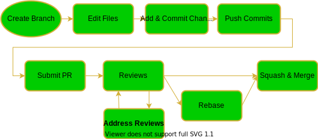

# Git Tutorial
A general explanation about git can be found below.
This tutorial explains the different stages of working with git in our team.
This graph shows the process, links to articles below.

List version of the process:
1. [**Create Branch**](create-branch.html)
2. **Edit Files** (no document, these are the changes you make to the code)
3. [**Add and Commit Changes**](commit.html)
4. [**Push Commits**](push.html)
5. [**Submit Pull Request**](create-pr.html)
6. [**Reviews**](reviews.html)
7. [**Rebase**](rebase.html) (not always relevant) 
8. [**Squash/Merge PR**](squash-merge.html)

# Git & GitHub
Git is the version control system that we use for team code, and we host our git repositories on [GitHub](https://github.com).

Some git terminology:
- **`repository`** (**`repo`**) - the project folder.
- **`commit`** - a group of changes that do something / a point in the history of the repo.
- **`branch`** - a commit history of the repo.
- **`clone`** - create a local copy of the repository.
- **`push`** - update the remote repository with your local changes.
- **`pull`** - update your local repository with the remote changes.
- **`pull request`** (**`PR`**) - a request to merge the changes in a branch to the main branch.

[frc-docs](https://docs.wpilib.org/en/stable/docs/software/basic-programming/git-getting-started.html)
has a good explanation of Git basics and a tutorial for creating your first repository.
This tutorial is for creating Pull Requests based on our Git workflow.

Our git workflow:

